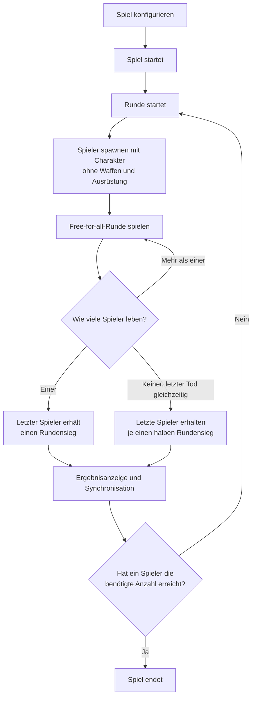

# B.O.N.K. Game Design

Diese Datei beschreibt die grundlegenden Designbereiche von B.O.N.K. und dient
als zentrale Übersicht für die weitere Ausarbeitung des Spiels.

## Game Rules

Im Folgenden werden die allgemeinen Spielregeln festgelegt. Zuerst wird
definiert, wie ein Spiel abläuft und wie der Gewinner bestimmt wird. Danach
werden die Aktionsmöglichkeiten für die Spieler definiert.

### What Is a Game and How to Win?

Ein Spiel besteht aus einer definierten Anzahl von Runden. Jede Runde findet
auf einer festgelegten Karte statt und folgt dem Spielmodus „Alle gegen alle“.
Alle Spieler starten in derselben Runde und versuchen, als letzte Person zu
überleben.

Die Person, die eine Runde als letzte überlebt, gewinnt diese Runde. Ein Spiel
endet, sobald eine Person die definierte Anzahl an Rundensiegen erreicht hat.
Diese Person gewinnt das gesamte Spiel.

| Regel | Festlegung |
| --- | --- |
| Spieleranzahl | Für ein Spiel sind 2 bis 4 Spieler vorgesehen. |
| Benötigte Rundensiege | Die benötigte Anzahl ist konfigurierbar. Der Standardwert für die erste Demo beträgt 5 Rundensiege; 10 oder 20 Rundensiege sind mögliche längere Matchvarianten. |
| Karte | Langfristig soll jede Runde auf einer neuen Karte spielen. Für die erste Demo ist zunächst eine einzige Karte vorgesehen. |
| Teilnahme an einer Runde | Jeder Spieler bleibt so lange in der Runde, bis sein Charakter stirbt. Der Tod beendet nur die Teilnahme an der aktuellen Runde. |
| Rundensieg | Der letzte noch lebende Spieler gewinnt die Runde und erhält einen Rundensieg. |
| Rundenneustart | Jeder Spieler startet mit dem für das Spiel gewählten Charakter, grundsätzlich voller Gesundheit und auf einer von vier Startpositionen. |
| Rundenstart | Eine Runde beginnt mit der Freigabe der Spielereingaben. Die notwendigen Zustände werden zuvor im Rahmen der Synchronisation vorbereitet. |
| Charakterabweichungen | Ein Charakter kann von der vollen Startgesundheit abweichen, wenn seine Definition dies vorsieht. |
| Fähigkeiten | Der Cooldown einer Fähigkeit startet mit Beginn der Runde. Beträgt der Cooldown 0, ist die Fähigkeit direkt verfügbar. |
| Ausrüstung | Alle Spieler starten jede Runde ohne Waffen und ohne Ausrüstung. |
| Gleichzeitiger Tod | Sterben mehrere Spieler innerhalb eines definierten Zeitfensters, gilt dies als gleichzeitiger Tod. Leben danach noch Spieler, erhalten die ausgeschiedenen Spieler keinen Rundensieg und die Runde wird fortgesetzt. Leben danach keine Spieler mehr, erhalten die zuletzt ausgeschiedenen Spieler jeweils einen halben Rundensieg. |
| Rundensieg-Wert | Ein normaler Rundensieg wird als `1.0`, ein halber Rundensieg als `0.5` und kein Rundensieg als `0.0` gespeichert. |
| Spielende | Das Spiel endet unmittelbar, sobald ein Spieler die benötigte Anzahl an Rundensiegen erreicht. |
| Rundenzeitlimit | Es gibt zunächst kein allgemeines Zeitlimit für eine Runde. Eine Karte kann später ein eigenes Zeitlimit definieren. |
| Kartenreihenfolge | Zu Beginn des Spiels wird eine zufällige Reihenfolge aus den verfügbaren Karten bestimmt. Diese Reihenfolge bleibt für das gesamte Spiel festgelegt. Für die erste Demo steht nur eine Karte zur Verfügung. |
| Zwischenrunden | Zwischen zwei Runden wird eine Ergebnisanzeige eingeblendet. Diese Anzeige kann später um weitere Events ergänzt werden. |
| Synchronisation | Vor Beginn der nächsten Runde synchronisiert das Spiel zwischen allen Spielern. Erst wenn alle Spieler auf dem gleichen Stand sind, startet die nächste Runde. |
| Verbindungsabbruch | Ein Verbindungsabbruch wird über die Synchronisation behandelt. Verliert ein Spieler während einer Runde die Verbindung, zählt dies wie sein Tod und beendet seine Teilnahme an dieser Runde. |
| Beitritt | Neue Spieler können einem laufenden Spiel nicht beitreten. Die Spielerkonfiguration wird über die Synchronisation zwischen den Runden beibehalten. |
| Charakterwahl | Jeder Spieler wählt für ein Spiel genau einen Charakter. Dieser Charakter bleibt für das gesamte Spiel aktiv und kann nicht gewechselt werden. |
| Kartenzeitlimit | Ein Zeitlimit ist zunächst nicht allgemein definiert. In Zukunft kann eine Karte ein eigenes Zeitlimit oder ein eigenes Event vorgeben. |



### What Can the Player Do?

Ein Spieler kann sich innerhalb der durch die Karte vorgegebenen begehbaren
Bereiche frei bewegen und seine verfügbaren Aktionen ausführen. Bewegungen und
Aktionen sind nicht auf einen bestimmten Bewegungszustand beschränkt.

#### Movement

| Bewegung | Tastaturbelegung | Festlegung |
| --- | --- | --- |
| Nach links bewegen | `A` oder Pfeiltaste links | Der Spieler kann sich nach links bewegen, soweit es die Karte erlaubt. |
| Nach rechts bewegen | `D` oder Pfeiltaste rechts | Der Spieler kann sich nach rechts bewegen, soweit es die Karte erlaubt. |
| Springen | `W` oder Pfeiltaste oben | Der Spieler kann springen. Ein Sprung kann mit einer Bewegungsrichtung nach links oder rechts verbunden werden. |
| Ducken | `S` oder Pfeiltaste unten | Der Spieler kann sich ducken. Auch beim Ducken kann eine Bewegungsrichtung nach links oder rechts beibehalten werden. |

#### Equipment Slots

Jeder Spieler besitzt einen Hand-Slot und drei standardmäßige Rüstungsslots.
Alle Gegenstände werden zunächst über den Hand-Slot aufgenommen. Nur
Gegenstände, die als Rüstung definiert sind, können aus dem Hand-Slot in einen
passenden Rüstungsslot angelegt werden.

| Slot | Erlaubte Gegenstände | Regel |
| --- | --- | --- |
| Hand-Slot | Waffen, Tränke und Rüstungsgegenstände | Es kann immer nur ein Gegenstand gleichzeitig in der Hand gehalten werden. |
| Kopfschutz | Helme | Nur ein Helm kann angelegt werden. Ist der Slot belegt, fällt der bisherige Helm beim Ersetzen auf die Karte. |
| Körperschutz | Körperrüstungen | Nur eine Körperrüstung kann angelegt werden. Ist der Slot belegt, fällt die bisherige Körperrüstung beim Ersetzen auf die Karte. |
| Fußschutz | Schuhe und andere Fußrüstungen | Nur ein Fußschutz kann angelegt werden. Ist der Slot belegt, fällt der bisherige Fußschutz beim Ersetzen auf die Karte. |

#### Actions
Alle verfügbaren Aktionen können in jedem Bewegungszustand eingesetzt werden, auch während der Spieler läuft, springt oder sich duckt.

| Aktion | Steuerung | Umfasst | Festlegung |
| --- | --- | --- | --- |
| Gegenstände aufnehmen und verwenden | Linksklick | Aufnehmen, schießen, Trank konsumieren und Rüstung anlegen | Ein kurzer Klick nimmt einen passenden Gegenstand auf, wenn der Hand-Slot frei ist. Wird der Linksklick gehalten, wird der gehaltene Gegenstand verwendet. Das Konsumieren eines Tranks und das Anlegen einer Rüstung benötigen eine definierte Ausführungsdauer. |
| Gegenstand fallen lassen | Rechtsklick | Gegenstand fallen lassen | Ein gehaltener Gegenstand wird in die aktuelle Laufrichtung geworfen. Dadurch wird der Hand-Slot frei. |
| Waffe nachladen | `R` | Nachladen | Eine nachladbare Waffe wird über `R` nachgeladen, wenn ihr Magazin leer ist. |
| Charakterfähigkeit einsetzen | `Q` oder UI-Button | Die definierte Fähigkeit des Charakters aktivieren | Die Fähigkeit kann über `Q` oder durch Anklicken des UI-Buttons ausgelöst werden, sofern sie verfügbar ist. Der UI-Button zeigt die Fähigkeit und ihren aktuellen Cooldown an. |

Das Fallenlassen von Ausrüstung beim Tod ist keine Spieleraktion. Stirbt ein
Spieler, lässt er seine angelegte Rüstung und den Gegenstand in seinem Hand-Slot
auf der Karte fallen.

Die Linksklick-Logik ist:

1. einen passenden Gegenstand aufnehmen, wenn der Hand-Slot frei ist,
2. den gehaltenen Gegenstand verwenden, solange der Linksklick gehalten wird,
3. bei einer gehaltenen Waffe während des Haltens zielen und beim Loslassen schießen.

Ein Trank wird durch Gedrückthalten konsumiert. Eine Rüstung wird durch
Gedrückthalten angelegt. Beide Aktionen werden erst nach ihrer vollständigen
Ausführungsdauer abgeschlossen. Bewegung unterbricht diese Aktionen nicht. Wird
der Linksklick vor Abschluss losgelassen, wird die jeweilige Aktion abgebrochen
und nicht angewendet. Beim Schießen wird während des Haltens gezielt; der Schuss
wird erst beim Loslassen des Linksklicks ausgelöst.

Ein Spieler kann somit gleichzeitig Kopfschutz, Körperschutz und Fußschutz
angelegt haben und einen Gegenstand im Hand-Slot halten. Die Rüstungsteile und
der gehaltene Gegenstand belegen unterschiedliche Slots.

## Game Items

Dieser Bereich beschreibt alle aufnehmbaren und verwendbaren Spielgegenstände,
einschließlich Waffen, Rüstungen, Tränken und weiteren Items.

Die Unterkategorien werden später jeweils in eigenen Dateien beschrieben:

- Waffen
- Rüstung
- Tränke

Spielgegenstände können durch Lootboxen auf der Map erhalten werden. Zusätzlich
können Charakterfähigkeiten bestimmte Gegenstände erzeugen oder einem Spieler
direkt zur Verfügung stellen. Ein Magier könnte beispielsweise eine Fähigkeit
besitzen, die ihm einen Trank gibt.

| Hauptkategorie | Beschreibung |
| --- | --- |
| Waffen | Gegenstände im Hand-Slot, die zum Angreifen verwendet werden und je nach Waffentyp Munition benötigen oder nachgeladen werden können. |
| Rüstung | Gegenstände, die über den Hand-Slot aufgenommen und anschließend in einen passenden Rüstungsslot angelegt werden. |
| Tränke | Verbrauchbare Gegenstände im Hand-Slot, die durch Gedrückthalten des Linksklicks konsumiert werden und einen Effekt auslösen. |

### Weapon File Format

Jede Waffe wird in einer eigenen YAML-Datei beschrieben:

```text
assets/items/weapons/<weapon-id>.yaml
```

| Bereich | Inhalt |
| --- | --- |
| Identity | Stabile ID, Anzeigename und Beschreibung |
| Classification | Waffentyp und Schadensart |
| Stats | Grundschaden, Schussverhalten, Munition, Projektil, Reichweite |
| Assets | Welt-Sprite, Hand-Sprite, Projektil und Audio |

### Weapon File Example

```yaml
id: weapon_001
display_name: Pistol
description: A reliable short-range weapon.

type: range
damage_type: physical

stats:
  damage:
    base: 20
    projectiles: 1
  firing:
    mode: single
    shots_per_second: 3
    spread: 0
  ammunition:
    magazine_size: 6
    reserve: 18
    reloadable: true
    reload_time: 1.2
  projectile:
    id: pistol_bullet
    speed: 600
    lifetime: 1.0
    radius: 2
  range: 600

assets:
  world_sprite: sprites/items/weapons/pistol.png
  hand_sprite: sprites/items/weapons/pistol-hand.png
  projectile_sprite: sprites/projectiles/pistol-bullet.png
  audio:
    shot: sounds/weapons/pistol-shot.wav
```

`type` beschreibt die Funktions- oder Waffenkategorie. `damage_type` beschreibt
die Schadensart und muss eine der zentral definierten Kategorien verwenden:
`physical`, `explosive` oder `magic`. Beide Werte werden unabhängig voneinander
gespeichert und gemeinsam zur Bestimmung des Schadensmodifikators verwendet.
Eine `range`-Waffe kann zum Beispiel physischen oder magischen Schaden
verursachen. Die zentralen Waffentypen sind zunächst `melee`, `range` und
`explosive`.
`magic` ist kein Waffentyp, sondern ausschließlich eine Schadensart. Eine
magische Nahkampfwaffe verwendet daher beispielsweise `type: melee` und
`damage_type: magic`.
Der Charaktermodifikator wird anhand der Kombination aus `type` und
`damage_type` der Waffe auf den jeweiligen Grundschaden angewendet. Dadurch
kann ein Ritter beispielsweise einen Bonus für `melee`-Waffen mit physischem
Schaden erhalten, während ein Paladin auf `melee`-Waffen mit magischem Schaden
spezialisiert ist.

`stats` enthält alle Werte, die das Verhalten der Waffe im Spiel bestimmen.
`stats.damage`, `stats.firing` und `stats.ammunition` bilden dabei den
notwendigen Kern jeder Waffe:

- `stats.damage.base` ist der Grundschaden eines einzelnen Treffers oder
 Projektils.
- `stats.damage.projectiles` gibt an, wie viele Projektile pro Angriff erzeugt
 werden. Der Standardwert ist `1`.
- `stats.firing.mode` definiert mindestens `single`; weitere Modi wie `automatic`
 oder `charge` können später ergänzt werden.
- `stats.firing.shots_per_second` ist für wiederholbare Angriffe erforderlich.
- `stats.firing.spread` definiert die Streuung und kann bei präzisen Waffen `0`
 sein.
- `stats.ammunition` ist nur für Waffen relevant, die Munition verwenden.
 `magazine_size`, `reloadable` und bei nachladbaren Waffen `reload_time`
 werden dann benötigt.

`stats.firing.charge_time` ist optional und wird nur für aufladbare Angriffe
angegeben. `stats.ammunition.reserve` ist optional für Waffen mit unbegrenzter
oder anders verwalteter Reserve. `stats.projectile` wird nur benötigt, wenn der
Angriff ein eigenständiges Projektil erzeugt. `stats.projectile.id` ist optional, wenn
die Projektildefinition direkt aus der Waffe erzeugt wird; Geschwindigkeit,
Lebensdauer und Radius sind für eigenständige Projektile erforderlich.
`stats.range` ist für alle Waffen erforderlich. `stats.effects` ist optional
und wird nur angelegt, wenn die Waffe zusätzliche Trefferwirkungen wie
Rückstoß besitzt.

`assets.audio.shot` verweist auf den Sound, der beim erfolgreichen Schuss
abgespielt wird. Der Sound gehört zur Waffendatei, damit jede Waffe ihren
eigenen Schuss-Sound verwenden kann.

Die aktuellen Munitionswerte, der Magazininhalt und die verbleibende
Nachladezeit gehören zum Laufzeitstatus und nicht in die Waffendatei. Die Datei
definiert nur die Ausgangswerte und Regeln der Waffe.

### Armor File Format

Jedes Rüstungsteil wird in einer eigenen YAML-Datei beschrieben:

```text
assets/items/armor/<armor-id>.yaml
```

`type` bestimmt, in welchen Rüstungsslot das Item angelegt werden kann. Die
zentralen Rüstungstypen sind zunächst `head`, `body` und `feet`.

```yaml
id: iron_helmet
display_name: Iron Helmet
description: A sturdy helmet that protects against physical damage.

type: head

stats:
  armor:
    physical: 25
    explosive: 5
    magic: 0

assets:
  world_sprite: sprites/items/armor/iron-helmet.png
  equipped_sprite: sprites/items/armor/iron-helmet-equipped.png
```

Die drei Werte unter `stats.armor` sind für jedes Rüstungsteil erforderlich:

- `physical` schützt vor physischem Schaden.
- `explosive` schützt vor Explosionsschaden.
- `magic` schützt vor magischem Schaden.

Die Werte werden beim Anlegen zur Charakterrüstung in derselben Schadensart
addiert. Ein Rüstungsteil kann auf diese Weise gegen eine Schadensart stark
und gegen andere Schadensarten schwach oder wirkungslos sein. `type` ist keine
Schadensart und bestimmt ausschließlich den kompatiblen Ausrüstungsslot.

### Potion File Format

Jeder Trank wird in einer eigenen YAML-Datei beschrieben:

```text
assets/items/potions/<potion-id>.yaml
```

`type` beschreibt die Nutzungsform und bestimmt, wie der Trank aktiviert wird.
Die ersten Tranktypen sind:

- `drink`: Der Trank wird vom Spieler getrunken und wirkt auf den Träger.
- `throw`: Der Trank wird als Projektil geworfen und wirkt beim Aufprall.

Die Wirkung wird nicht aus dem Typ abgeleitet. Ein `drink`-Trank kann heilen
oder einen zeitlich begrenzten positiven Effekt verleihen. Ein `throw`-Trank
kann Schaden verursachen oder einen negativen Effekt auf ein Ziel anwenden.

```yaml
id: healing_potion
display_name: Healing Potion
description: Restores health when consumed.

type: drink

stats:
  use_time: 1.0
  target: self
  effects:
    - type: heal
      amount: 40

assets:
  world_sprite: sprites/items/potions/healing-potion.png
  hand_sprite: sprites/items/potions/healing-potion-hand.png
  audio:
    use: sounds/potions/healing-potion-use.wav
```

Ein geworfener Schadens- oder Debuff-Trank kann dieselbe Struktur verwenden:

```yaml
id: poison_flask
display_name: Poison Flask
description: Applies a damage-over-time effect on impact.

type: throw

stats:
  use_time: 0.3
  target: area
  projectile:
    speed: 450
    lifetime: 1.5
    radius: 8
  effects:
    - type: damage_over_time
      damage_type: magic
      damage_per_second: 10
      duration: 4.0

assets:
  world_sprite: sprites/items/potions/poison-flask.png
  hand_sprite: sprites/items/potions/poison-flask-hand.png
  projectile_sprite: sprites/projectiles/poison-flask.png
  audio:
    impact: sounds/potions/poison-flask-impact.wav
```

`stats.use_time` ist die Aktivierungsdauer. `stats.target` definiert das
Zielmodell, zum Beispiel `self`, `target` oder `area`. `stats.effects` enthält
eine oder mehrere Wirkungen. Jede Wirkung benötigt mindestens einen `type`;
zusätzliche Werte wie `amount`, `duration`, `damage_type` oder
`damage_per_second` hängen von dieser Wirkung ab. Bei geworfenen Tränken ist
`stats.projectile` erforderlich. Bei getrunkenen Tränken wird es weggelassen.

`assets.audio.use` ist der Sound für die erfolgreiche Verwendung des Tranks und
für jeden Trank erforderlich. Bei `type: throw` ist zusätzlich
`assets.audio.impact` für den Aufprall erforderlich. Bei `type: drink` wird
`impact` weggelassen.

Ein Trank ist nach erfolgreicher Anwendung verbraucht. Der laufende Effekt,
die verbleibende Dauer und die bereits angewendete Wirkung gehören zum
Laufzeitstatus und nicht in die Item-Datei.

## Character Design

Für jeden Charakter wird eine eigene YAML-Datei im Asset- beziehungsweise
Content-Bereich angelegt. Die Datei beschreibt die festen Eigenschaften des
Charakters und verweist auf die benötigten visuellen Assets. Der aktuelle
Spielzustand, zum Beispiel die verbleibende Gesundheit oder ein laufender
Cooldown, gehört nicht in diese Datei.

### Character File Format

Die Charakterdateien liegen unter:

```text
assets/characters/<character-id>.yaml
```

#### Character Defaults Example

Die globalen Standardwerte liegen separat unter:

```text
assets/config/character-defaults.yaml
```
Die Standarddatei enthält die gemeinsame Ausgangsstruktur. Eine Charakterdatei
muss nur Pflichtfelder und Werte enthalten, die vom Standard abweichen.

```yaml
stats:
  movement_speed: 180
  health: 100
  health_regeneration: 0
  armor:
    physical: 0
    explosive: 0
    magic: 0
  damage_modifiers:
    melee:
      physical: 1.0
      explosive: 1.0
      magic: 1.0
    range:
      physical: 1.0
      explosive: 1.0
      magic: 1.0
    explosive:
      physical: 1.0
      explosive: 1.0
      magic: 1.0
abilities:
  passive: []

equipment:
  starting_items: []
```

Jede Charakterdatei muss mindestens folgende Bereiche enthalten:

| Bereich | Inhalt |
| --- | --- |
| id | Stabile ID |
| display_name | Anzeigename |
| description | kurze Beschreibung |
| role_id | Stabile Referenz auf eine eigene Rollendatei |
| Stats | Initiale Bewegungsgeschwindigkeit, Gesundheit, Gesundheitsregeneration, Rüstung und Schadensmodifikatoren |
| Abilities | Referenzen auf aktive und optionale passive Fähigkeiten |
| Equipment | Optionale Start-Items und Regeln für besondere Ausrüstung |
| Collision | Körpergröße, Collider und Duck-Höhe |
| Assets | Sprite-Sheet, Animationen, UI-Icon, Porträt und Audio-Referenzen |

### Character File Example

```yaml
id: character_id
display_name: Character Name
description: Short description of the character concept.
role_id: role_bruiser

stats:
  movement_speed: 180
  health: 100
  health_regeneration: 0
  armor:
    physical: 0
    explosive: 0
    magic: 0
  damage_modifiers:
    melee:
      physical: 1.0
      explosive: 1.0
      magic: 1.0
    range:
      physical: 1.0
      explosive: 1.0
      magic: 1.0
    explosive:
      physical: 1.0
      explosive: 1.0
      magic: 1.0
abilities:
  active:
    id: ability_id
  passive: []

equipment:
  starting_items: []

collision:
  width: 32
  height: 64
  crouch_height: 40
  pivot: [16, 64]

assets:
  sprite_sheet: sprites/characters/character_id.png
  frame_size: [32, 64]
  scale: 1.0
  pivot: [16, 64]
  icon: ui/characters/character_id-icon.png
  portrait: ui/characters/character_id-portrait.png
  animations:
    idle: idle
    run: run
    jump: jump
    fall: fall
    crouch: crouch
    hurt: hurt
    death: death
  audio:
    footsteps: sounds/characters/character_id-footsteps.wav
    hurt: sounds/characters/character_id-hurt.wav
    death: sounds/characters/character_id-death.wav
```

Die Werte unter `stats` bilden die initialen Charakterwerte für das Spiel:

- `movement_speed` definiert die grundlegende Bewegungsgeschwindigkeit.
- `health` definiert die maximale Gesundheit und den Ausgangswert zu
  Rundenbeginn, sofern der Charakter keine abweichende Regel besitzt.
- `health_regeneration` definiert die passive Gesundheitsregeneration.
- `stats.armor` definiert getrennte Rüstungswerte für physische, explosive und
  magische Schadensarten.
- `stats.damage_modifiers` verändert den verursachten Schaden je nach
  Kombination aus Waffentyp und Schadensart.
  Der Wert `1.0` entspricht 100 Prozent des normalen Schadens,
  `2.0` entspricht 200 Prozent und `0.5` entspricht 50 Prozent.

Die äußeren Kategorien in `stats.damage_modifiers` entsprechen den zentral
definierten Waffentypen. Die inneren Kategorien entsprechen den zentral
definierten Schadensarten. Dadurch können Charaktere gezielt bestimmte
Kombinationen verstärken:

```yaml
# Ritter: spezialisiert auf physische Nahkampfangriffe
damage_modifiers:
  melee:
    physical: 2.0
    explosive: 1.0
    magic: 1.0

# Kampfmagier: spezialisiert auf magische Nahkampfangriffe
damage_modifiers:
  melee:
    physical: 1.0
    explosive: 1.0
    magic: 2.0
```

Ein Bonus für `melee.physical` gilt nur für eine Waffe, deren Werte
`type: melee` und `damage_type: physical` enthalten. Eine magische
Nahkampfwaffe verwendet stattdessen `melee.magic`. Es gibt keinen separaten
Fallback vom kombinierten Wert auf den Waffentyp; nicht spezifizierte
Kombinationen werden beim Erzeugen der vollständigen Charakterdaten mit dem
Standardwert `1.0` ergänzt.

Jeder Charakter besitzt einen eigenen Rüstungswert für jede der drei Schadensarten:

- `physical` für stumpfen und spitzen Schaden,
- `explosive` für Explosionsschaden,
- `magic` für magischen Schaden.

Die Rüstungswerte des Charakters werden mit den Rüstungswerten der angelegten
Gegenstände in derselben Schadensart addiert. Ein Ritter kann beispielsweise
eine erhöhte `physical`-Rüstung besitzen, während seine Explosions- und
Magie-Rüstung unverändert bleiben. Eine separate Resistenz-Eigenschaft gibt es
nicht; die Schadensreduktion wird ausschließlich aus der passenden
Rüstungskategorie berechnet.

Die Schadensreduktion verwendet zunächst folgende Formel:

```text
tatsächlicher Schaden = Eingangsschaden × 100 / (100 + armor)
```

Dabei ist `stats.armor` die Summe aus der Charakterrüstung und der Rüstung der
angelegten Gegenstände in der jeweiligen Schadensart. Bei `0` Rüstung wird der
volle Schaden verursacht, bei `100` Rüstung die Hälfte. Die Formel erzeugt
eine abnehmende Wirkung zusätzlicher Rüstung; konkrete Grenzwerte können beim
Balancing festgelegt werden.

`stats.damage_modifiers` wird anhand der beiden Waffenwerte `type` und
`damage_type` auf den Grundschaden angewendet. Für jedes Projektil gilt:

```text
Eingangsschaden =
  stats.damage.base × damage_modifiers[type][damage_type]
```

Verursacht eine Waffe mehrere Projektile, besitzt jedes Projektil seinen
eigenen Grundschaden und wird separat berechnet. Erst danach wird beim Ziel die
passende Armor-Kategorie anhand von `damage_type` angewendet.

`health_regeneration` wird in Gesundheit pro Sekunde angegeben. Sie wirkt nur,
wenn sich der Spieler außerhalb des Kampfes befindet, und kann die maximale
Gesundheit nicht überschreiten. Die genaue Definition von „außerhalb des
Kampfes“ wird zusammen mit dem Schadens- und Kampfsystem festgelegt.

`role_id` verweist über eine stabile ID auf eine eigene Rollendatei. Der
sichtbare Rollenname wird ausschließlich über `display_name` der Rollendatei
definiert. Unter `abilities.active` wird die
verpflichtende aktive Fähigkeit referenziert. `abilities.passive` enthält
optionale Referenzen auf passive Fähigkeiten. Beide Fähigkeitstypen werden in
eigenen Dateien angelegt. `starting_items` ist optional und standardmäßig leer.

Beim Laden werden die globalen Standardwerte zuerst geladen und anschließend
mit den Werten der Charakterdatei überschrieben. Die erzeugte Player-Struktur
enthält danach immer alle benötigten Werte und muss während der Spielsitzung
keine fehlenden Felder behandeln. Die Standardwerte sind dadurch zentral
sichtbar und müssen nicht in jeder Charakterdatei wiederholt werden.

Pflichtfelder wie `id`, `display_name`, `description`, `role_id`,
`abilities.active.id` und die grundlegenden Asset-Referenzen müssen angegeben
werden. Fehlen sie, ist die
Charakterdatei ungültig und darf nicht als spielbarer Charakter geladen werden.

Jeder Charakter besitzt genau eine aktive Fähigkeit. `starting_items` ist optional und
kann leer bleiben, wenn ein Charakter ohne Startausrüstung beginnen soll.

Die grundlegenden Bewegungsaktionen wie Laufen, Springen und Ducken sind für
alle Charaktere gleich. Nur die Bewegungsgeschwindigkeit kann sich zwischen
Charakteren unterscheiden. Die konkreten Werte für Gesundheit und Fähigkeiten werden erst bei
der Ausarbeitung des jeweiligen Charakters festgelegt. Neue Charaktere sollen
dieselbe Dateistruktur verwenden, damit sie ohne Sonderformat in die
Spielauswahl aufgenommen werden können.

### Role File Example

Rollendateien liegen separat unter:

```text
assets/roles/<role-id>.yaml
```

Eine Rolle beschreibt gemeinsame Design- und Content-Gewichtungen, ohne die
individuellen Charakterwerte zu ersetzen. Eine Rolle kann beispielsweise
festlegen, dass ein `bruiser` bei Lootboxen häufiger Nahkampfwaffen angeboten
bekommt.

```yaml
id: role_001
display_name: Bruiser
description: Close-range focused role.

loot_preferences:
  weapons:
    melee: 2.0
    range: 1.0
    explosive: 1.0
  armor:
    physical: 1.0
    explosive: 1.0
    magic: 1.0
  potions: 1.0
```

Die Werte unter `loot_preferences` sind Gewichtungen und keine direkten
Garantien. Die konkrete Lootbox entscheidet anhand dieser Gewichtungen und
ihres eigenen Inhalts, welcher Gegenstand angeboten werden kann.

### Character Sprite and Equipment Layers

Der Charakter und seine Ausrüstung werden als getrennte visuelle Ebenen
gerendert. Dadurch müssen nicht für jede Kombination aus Charakter, Helm,
Körperrüstung, Schuhen und Waffe eigene Sprite-Sheets erstellt werden.

Die Ebenen verwenden dasselbe Koordinatensystem, dieselbe Frame-Größe und
denselben Fußpunkt:

1. Charakter-Sprite als Basis,
2. angelegte Rüstung als passende Overlay-Ebenen,
3. gehaltener Gegenstand oder Waffe an einem definierten Hand- beziehungsweise
   Waffen-Ankerpunkt,
4. optionale Effekte über den übrigen Ebenen.

Rüstung und Waffen benötigen daher eigene Sprite-Referenzen und können
Animationszustände oder Richtungsvarianten bereitstellen. Die Charakterdatei
referenziert die Basis-Assets; die Item-Dateien referenzieren die jeweiligen
Overlay- und Hand-Assets. Eine Ausrüstung kann dadurch beim Aufnehmen,
Anlegen, Fallenlassen und Wechseln sichtbar ein- und ausgeblendet werden.

Der sichtbare Sprite und der physische Collider sind getrennt. Der Collider
bestimmt Kollisionen und verwendet den Fußpunkt als stabile Position. Das
Sprite darf über den Collider hinausragen, ohne die Kollisionsfläche zu
verändern.

### Character Collision

Der stehende Collider beschreibt die normale Körperfläche. Beim Ducken wird
seine Höhe auf `crouch_height` reduziert, während der Fußpunkt an derselben
Stelle bleibt. Ein Spieler kann nur wieder aufstehen, wenn oberhalb des
reduzierten Colliders ausreichend Platz für den stehenden Collider vorhanden
ist. Die verwendeten Maßeinheiten werden global für das Spiel festgelegt.

## Maps
