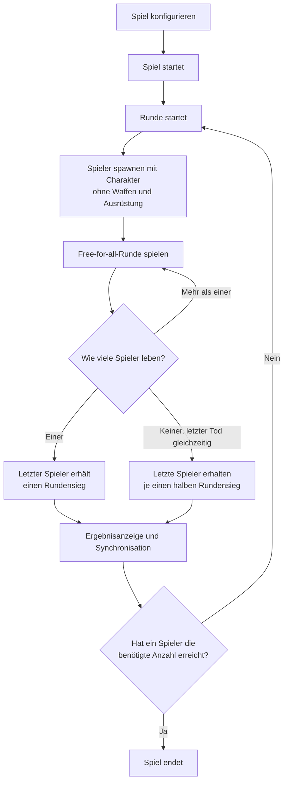

# B.O.N.K. Game Design

Diese Datei beschreibt die grundlegenden Designbereiche von B.O.N.K. und dient
als zentrale Übersicht für die weitere Ausarbeitung des Spiels.

## Game Rules

Im Folgenden werden die allgemeinen Spielregeln festgelegt. Zuerst wird
definiert, wie ein Spiel abläuft und wie der Gewinner bestimmt wird. Danach
werden die Aktionsmöglichkeiten für die Spieler definiert.

### What Is a Game and How to Win?

Ein Spiel besteht aus einer definierten Anzahl von Runden. Jede Runde findet
auf einer festgelegten Karte statt und folgt dem Spielmodus „Alle gegen alle“.
Alle Spieler starten in derselben Runde und versuchen, als letzte Person zu
überleben.

Die Person, die eine Runde als letzte überlebt, gewinnt diese Runde. Ein Spiel
endet, sobald eine Person die definierte Anzahl an Rundensiegen erreicht hat.
Diese Person gewinnt das gesamte Spiel.

| Regel | Festlegung |
| --- | --- |
| Spieleranzahl | Für ein Spiel sind 2 bis 4 Spieler vorgesehen. |
| Benötigte Rundensiege | Die benötigte Anzahl ist konfigurierbar. Der Standardwert für die erste Demo beträgt 5 Rundensiege; 10 oder 20 Rundensiege sind mögliche längere Matchvarianten. |
| Karte | Langfristig soll jede Runde auf einer neuen Karte spielen. Für die erste Demo ist zunächst eine einzige Karte vorgesehen. |
| Teilnahme an einer Runde | Jeder Spieler bleibt so lange in der Runde, bis sein Charakter stirbt. Der Tod beendet nur die Teilnahme an der aktuellen Runde. |
| Rundensieg | Der letzte noch lebende Spieler gewinnt die Runde und erhält einen Rundensieg. |
| Rundenneustart | Jeder Spieler startet mit dem für das Spiel gewählten Charakter, grundsätzlich voller Gesundheit und auf einer von vier Startpositionen. |
| Rundenstart | Eine Runde beginnt mit der Freigabe der Spielereingaben. Die notwendigen Zustände werden zuvor im Rahmen der Synchronisation vorbereitet. |
| Charakterabweichungen | Ein Charakter kann von der vollen Startgesundheit abweichen, wenn seine Definition dies vorsieht. |
| Fähigkeiten | Der Cooldown einer Fähigkeit startet mit Beginn der Runde. Beträgt der Cooldown 0, ist die Fähigkeit direkt verfügbar. |
| Ausrüstung | Alle Spieler starten jede Runde ohne Waffen und ohne Ausrüstung. |
| Gleichzeitiger Tod | Sterben mehrere Spieler innerhalb eines definierten Zeitfensters, gilt dies als gleichzeitiger Tod. Leben danach noch Spieler, erhalten die ausgeschiedenen Spieler keinen Rundensieg und die Runde wird fortgesetzt. Leben danach keine Spieler mehr, erhalten die zuletzt ausgeschiedenen Spieler jeweils einen halben Rundensieg. |
| Rundensieg-Wert | Ein normaler Rundensieg wird als `1.0`, ein halber Rundensieg als `0.5` und kein Rundensieg als `0.0` gespeichert. |
| Spielende | Das Spiel endet unmittelbar, sobald ein Spieler die benötigte Anzahl an Rundensiegen erreicht. |
| Rundenzeitlimit | Es gibt zunächst kein allgemeines Zeitlimit für eine Runde. Eine Karte kann später ein eigenes Zeitlimit definieren. |
| Kartenreihenfolge | Zu Beginn des Spiels wird eine zufällige Reihenfolge aus den verfügbaren Karten bestimmt. Diese Reihenfolge bleibt für das gesamte Spiel festgelegt. Für die erste Demo steht nur eine Karte zur Verfügung. |
| Zwischenrunden | Zwischen zwei Runden wird eine Ergebnisanzeige eingeblendet. Diese Anzeige kann später um weitere Events ergänzt werden. |
| Synchronisation | Vor Beginn der nächsten Runde synchronisiert das Spiel zwischen allen Spielern. Erst wenn alle Spieler auf dem gleichen Stand sind, startet die nächste Runde. |
| Verbindungsabbruch | Ein Verbindungsabbruch wird über die Synchronisation behandelt. Verliert ein Spieler während einer Runde die Verbindung, zählt dies wie sein Tod und beendet seine Teilnahme an dieser Runde. |
| Beitritt | Neue Spieler können einem laufenden Spiel nicht beitreten. Die Spielerkonfiguration wird über die Synchronisation zwischen den Runden beibehalten. |
| Charakterwahl | Jeder Spieler wählt für ein Spiel genau einen Charakter. Dieser Charakter bleibt für das gesamte Spiel aktiv und kann nicht gewechselt werden. |
| Kartenzeitlimit | Ein Zeitlimit ist zunächst nicht allgemein definiert. In Zukunft kann eine Karte ein eigenes Zeitlimit oder ein eigenes Event vorgeben. |

### What Can the Player Do?

## Character Design

## Maps

## Weapons and Equipment
