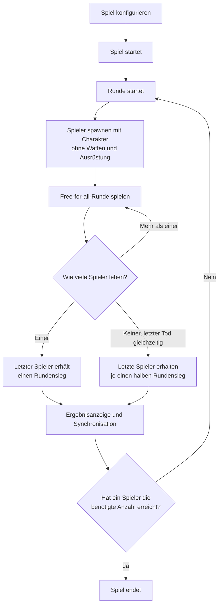

# B.O.N.K. Game Design

Diese Datei beschreibt die grundlegenden Designbereiche von B.O.N.K. und dient
als zentrale Übersicht für die weitere Ausarbeitung des Spiels.

## Game Rules

Im Folgenden werden die allgemeinen Spielregeln festgelegt. Zuerst wird
definiert, wie ein Spiel abläuft und wie der Gewinner bestimmt wird. Danach
werden die Aktionsmöglichkeiten für die Spieler definiert.

### What Is a Game and How to Win?

Ein Spiel besteht aus einer definierten Anzahl von Runden. Jede Runde findet
auf einer festgelegten Karte statt und folgt dem Spielmodus „Alle gegen alle“.
Alle Spieler starten in derselben Runde und versuchen, als letzte Person zu
überleben.

Die Person, die eine Runde als letzte überlebt, gewinnt diese Runde. Ein Spiel
endet, sobald eine Person die definierte Anzahl an Rundensiegen erreicht hat.
Diese Person gewinnt das gesamte Spiel.

| Regel | Festlegung |
| --- | --- |
| Spieleranzahl | Für ein Spiel sind 2 bis 4 Spieler vorgesehen. |
| Benötigte Rundensiege | Die benötigte Anzahl ist konfigurierbar. Der Standardwert für die erste Demo beträgt 5 Rundensiege; 10 oder 20 Rundensiege sind mögliche längere Matchvarianten. |
| Karte | Langfristig soll jede Runde auf einer neuen Karte spielen. Für die erste Demo ist zunächst eine einzige Karte vorgesehen. |
| Teilnahme an einer Runde | Jeder Spieler bleibt so lange in der Runde, bis sein Charakter stirbt. Der Tod beendet nur die Teilnahme an der aktuellen Runde. |
| Rundensieg | Der letzte noch lebende Spieler gewinnt die Runde und erhält einen Rundensieg. |
| Rundenneustart | Jeder Spieler startet mit dem für das Spiel gewählten Charakter, grundsätzlich voller Gesundheit und auf einer von vier Startpositionen. |
| Rundenstart | Eine Runde beginnt mit der Freigabe der Spielereingaben. Die notwendigen Zustände werden zuvor im Rahmen der Synchronisation vorbereitet. |
| Charakterabweichungen | Ein Charakter kann von der vollen Startgesundheit abweichen, wenn seine Definition dies vorsieht. |
| Fähigkeiten | Der Cooldown einer Fähigkeit startet mit Beginn der Runde. Beträgt der Cooldown 0, ist die Fähigkeit direkt verfügbar. |
| Ausrüstung | Alle Spieler starten jede Runde ohne Waffen und ohne Ausrüstung. |
| Schadensarten | Es gibt zunächst `physical` und `magic`. |
| Waffentypen | Es gibt zunächst `melee`, `range` und `explosive`. Die ausführliche Definition steht in [Weapons](items/weapons.md). |
| Tranktypen | Es gibt zunächst `drink` und `throw`. Die ausführliche Definition steht in [Potions](items/potions.md). |
| Rüstungstypen | Es gibt zunächst `head`, `body` und `feet`. Die ausführliche Definition steht in [Armor](items/armor.md). |
| Gleichzeitiger Tod | Sterben mehrere Spieler innerhalb eines definierten Zeitfensters, gilt dies als gleichzeitiger Tod. Leben danach noch Spieler, erhalten die ausgeschiedenen Spieler keinen Rundensieg und die Runde wird fortgesetzt. Leben danach keine Spieler mehr, erhalten die zuletzt ausgeschiedenen Spieler jeweils einen halben Rundensieg. |
| Rundensieg-Wert | Ein normaler Rundensieg wird als `1.0`, ein halber Rundensieg als `0.5` und kein Rundensieg als `0.0` gespeichert. |
| Spielende | Das Spiel endet unmittelbar, sobald ein Spieler die benötigte Anzahl an Rundensiegen erreicht. |
| Rundenzeitlimit | Es gibt zunächst kein allgemeines Zeitlimit für eine Runde. Eine Karte kann später ein eigenes Zeitlimit definieren. |
| Kartenreihenfolge | Zu Beginn des Spiels wird eine zufällige Reihenfolge aus den verfügbaren Karten bestimmt. Diese Reihenfolge bleibt für das gesamte Spiel festgelegt. Für die erste Demo steht nur eine Karte zur Verfügung. |
| Zwischenrunden | Zwischen zwei Runden wird eine Ergebnisanzeige eingeblendet. Diese Anzeige kann später um weitere Events ergänzt werden. |
| Synchronisation | Vor Beginn der nächsten Runde synchronisiert das Spiel zwischen allen Spielern. Erst wenn alle Spieler auf dem gleichen Stand sind, startet die nächste Runde. |
| Verbindungsabbruch | Ein Verbindungsabbruch wird über die Synchronisation behandelt. Verliert ein Spieler während einer Runde die Verbindung, zählt dies wie sein Tod und beendet seine Teilnahme an dieser Runde. |
| Beitritt | Neue Spieler können einem laufenden Spiel nicht beitreten. Die Spielerkonfiguration wird über die Synchronisation zwischen den Runden beibehalten. |
| Charakterwahl | Jeder Spieler wählt für ein Spiel genau einen Charakter. Dieser Charakter bleibt für das gesamte Spiel aktiv und kann nicht gewechselt werden. |
| Kartenzeitlimit | Ein Zeitlimit ist zunächst nicht allgemein definiert. In Zukunft kann eine Karte ein eigenes Zeitlimit oder ein eigenes Event vorgeben. |

### What Can the Player Do?

Ein Spieler kann sich innerhalb der durch die Karte vorgegebenen begehbaren
Bereiche frei bewegen und seine verfügbaren Aktionen ausführen. Bewegungen und
Aktionen sind nicht auf einen bestimmten Bewegungszustand beschränkt.

#### Movement

| Bewegung | Tastaturbelegung | Festlegung |
| --- | --- | --- |
| Nach links bewegen | `A` oder Pfeiltaste links | Der Spieler kann sich nach links bewegen, soweit es die Karte erlaubt. |
| Nach rechts bewegen | `D` oder Pfeiltaste rechts | Der Spieler kann sich nach rechts bewegen, soweit es die Karte erlaubt. |
| Springen | `W` oder Pfeiltaste oben | Der Spieler kann springen. Ein Sprung kann mit einer Bewegungsrichtung nach links oder rechts verbunden werden. |
| Ducken | `S` oder Pfeiltaste unten | Der Spieler kann sich ducken. Auch beim Ducken kann eine Bewegungsrichtung nach links oder rechts beibehalten werden. |

#### Equipment Slots

Jeder Spieler besitzt einen Hand-Slot und drei standardmäßige Rüstungsslots.
Alle Gegenstände werden zunächst über den Hand-Slot aufgenommen. Nur
Gegenstände, die als Rüstung definiert sind, können aus dem Hand-Slot in einen
passenden Rüstungsslot angelegt werden.

| Slot | Erlaubte Gegenstände | Regel |
| --- | --- | --- |
| Hand-Slot | Waffen, Tränke und Rüstungsgegenstände | Es kann immer nur ein Gegenstand gleichzeitig in der Hand gehalten werden. |
| Kopfschutz | Helme | Nur ein Helm kann angelegt werden. Ist der Slot belegt, fällt der bisherige Helm beim Ersetzen auf die Karte. |
| Körperschutz | Körperrüstungen | Nur eine Körperrüstung kann angelegt werden. Ist der Slot belegt, fällt die bisherige Körperrüstung beim Ersetzen auf die Karte. |
| Fußschutz | Schuhe und andere Fußrüstungen | Nur ein Fußschutz kann angelegt werden. Ist der Slot belegt, fällt der bisherige Fußschutz beim Ersetzen auf die Karte. |

#### Actions
Alle verfügbaren Aktionen können in jedem Bewegungszustand eingesetzt werden, auch während der Spieler läuft, springt oder sich duckt.

| Aktion | Steuerung | Umfasst | Festlegung |
| --- | --- | --- | --- |
| Gegenstände aufnehmen und verwenden | Linksklick | Aufnehmen, schießen, Trank konsumieren und Rüstung anlegen | Ein kurzer Klick nimmt einen passenden Gegenstand auf, wenn der Hand-Slot frei ist. Wird der Linksklick gehalten, wird der gehaltene Gegenstand verwendet. Das Konsumieren eines Tranks und das Anlegen einer Rüstung benötigen eine definierte Ausführungsdauer. |
| Gegenstand fallen lassen | Rechtsklick | Gegenstand fallen lassen | Ein gehaltener Gegenstand wird in die aktuelle Laufrichtung geworfen. Dadurch wird der Hand-Slot frei. |
| Waffe nachladen | `R` | Nachladen | Eine nachladbare Waffe wird über `R` nachgeladen, wenn ihr Magazin leer ist. |
| Charakterfähigkeit einsetzen | `Q` oder UI-Button | Die definierte Fähigkeit des Charakters aktivieren | Die Fähigkeit kann über `Q` oder durch Anklicken des UI-Buttons ausgelöst werden, sofern sie verfügbar ist. Der UI-Button zeigt die Fähigkeit und ihren aktuellen Cooldown an. |

Das Fallenlassen von Ausrüstung beim Tod ist keine Spieleraktion. Stirbt ein
Spieler, lässt er seine angelegte Rüstung und den Gegenstand in seinem Hand-Slot
auf der Karte fallen.

Die Linksklick-Logik ist:

1. einen passenden Gegenstand aufnehmen, wenn der Hand-Slot frei ist,
2. den gehaltenen Gegenstand verwenden, solange der Linksklick gehalten wird,
3. bei einer gehaltenen Waffe während des Haltens zielen und beim Loslassen schießen.

Ein Trank wird durch Gedrückthalten konsumiert. Eine Rüstung wird durch
Gedrückthalten angelegt. Beide Aktionen werden erst nach ihrer vollständigen
Ausführungsdauer abgeschlossen. Bewegung unterbricht diese Aktionen nicht. Wird
der Linksklick vor Abschluss losgelassen, wird die jeweilige Aktion abgebrochen
und nicht angewendet. Beim Schießen wird während des Haltens gezielt; der Schuss
wird erst beim Loslassen des Linksklicks ausgelöst.

Ein Spieler kann somit gleichzeitig Kopfschutz, Körperschutz und Fußschutz
angelegt haben und einen Gegenstand im Hand-Slot halten. Die Rüstungsteile und
der gehaltene Gegenstand belegen unterschiedliche Slots.

## Game Items

Dieser Bereich beschreibt alle aufnehmbaren und verwendbaren Spielgegenstände,
einschließlich Waffen, Rüstungen, Tränken und weiteren Items.

Spielgegenstände können durch Lootboxen auf der Map erhalten werden. Zusätzlich
können Charakterfähigkeiten bestimmte Gegenstände erzeugen oder einem Spieler
direkt zur Verfügung stellen. Ein Magier könnte beispielsweise eine Fähigkeit
besitzen, die ihm einen Trank gibt.

| Hauptkategorie | Beschreibung |
| --- | --- |
| Waffen | Gegenstände im Hand-Slot, die zum Angreifen verwendet werden und je nach Waffentyp Munition benötigen oder nachgeladen werden können. |
| Rüstung | Gegenstände, die über den Hand-Slot aufgenommen und anschließend in einen passenden Rüstungsslot angelegt werden. |
| Tränke | Verbrauchbare Gegenstände im Hand-Slot, die durch Gedrückthalten des Linksklicks konsumiert werden und einen Effekt auslösen. |

Die ausführlichen Definitionen der bestehenden Item-Kategorien befinden sich in eigenen Dokumenten:

- [Weapons](items/weapons.md)
- [Armor](items/armor.md)
- [Potions](items/potions.md)

## Character Design

Die vollständige technische Definition der Charaktere befindet sich im separaten Dokument [Character Design](characters/character-design.md).

## Maps
